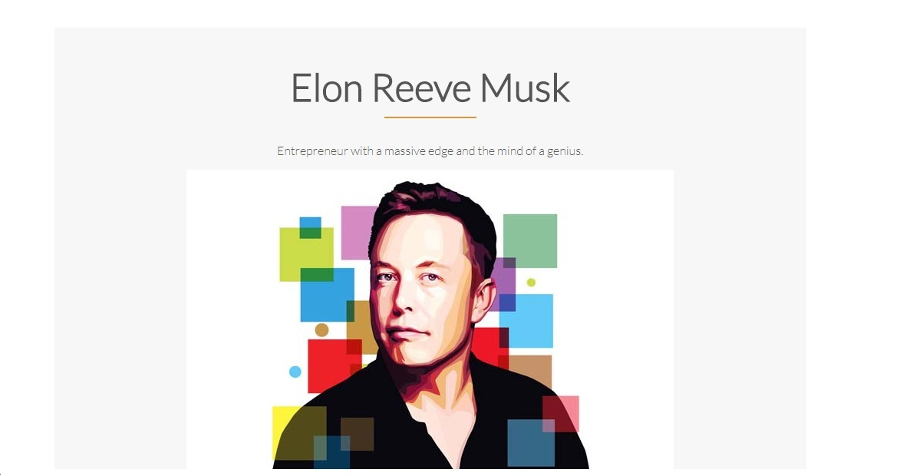
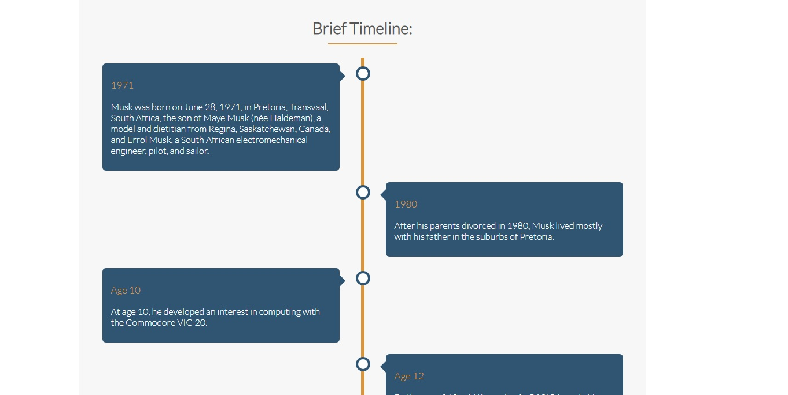

# fcc-tribute-page

Tribute page dedicated to Elon Musk. This project is part of [FreeCodeCamp Responsive Web Design Certification](https://learn.freecodecamp.org/responsive-web-design/responsive-web-design-projects/build-a-tribute-page).

## Live Demonstration

Live project link: <https://codepen.io/rmasianjr/full/wQePaO/>

## Screenshots

## Objective

Build a CodePen.io app that is functionally similar to this: <https://codepen.io/freeCodeCamp/full/zNqgVx>. Fulfill the below user stories and get all of the tests to pass. Give it your own personal style. You can use HTML, JavaScript, and CSS to complete this project. Plain CSS is recommended because that is what the lessons have covered so far and you should get some practice with plain CSS. You can use Bootstrap or SASS if you choose. Additional technologies (just for example jQuery, React, Angular, or Vue) are not recommended for this project, and using them is at your own risk. Other projects will give you a chance to work with different technology stacks like React. We will accept and try to fix all issue reports that use the suggested technology stack for this project. Happy coding!

## User Stories

- [x] My tribute page should have an element with corresponding `id="main"`, which contains all other elements.
- [x] I should see an element with corresponding `id="title"`, which contains a string (i.e. text) that describes the subject of the tribute page (e.g. "Dr. Norman Borlaug").
- [x] I should see a `
` element with corresponding `id="img-div"`.
- [x] Within the `img-div` element, I should see an `` element with a corresponding `id="image"`.
- [x] Within the `img-div` element, I should see an element with a corresponding `id="img-caption"` that contains textual content describing the image shown in `img-div`.
- [x] I should see an element with a corresponding `id="tribute-info"`, which contains textual content describing the subject of the tribute page.
- [x] I should see an `<a>` element with a corresponding `id="tribute-link"`, which links to an outside site that contains additional information about the subject of the tribute page. HINT: You must give your element an attribute of target and set it to `"_blank"` in order for your link to open in a new tab (i.e. `target="_blank"`).
- [x] The `` element should responsively resize, relative to the width of its parent element, without exceeding its original size.
- [x] The `` element should be centered within its parent element.
